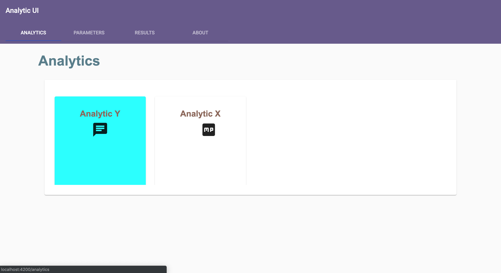
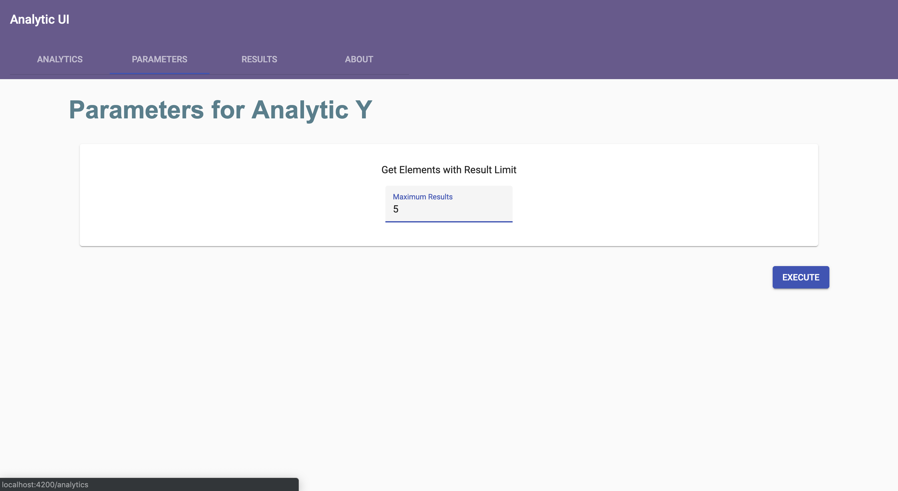
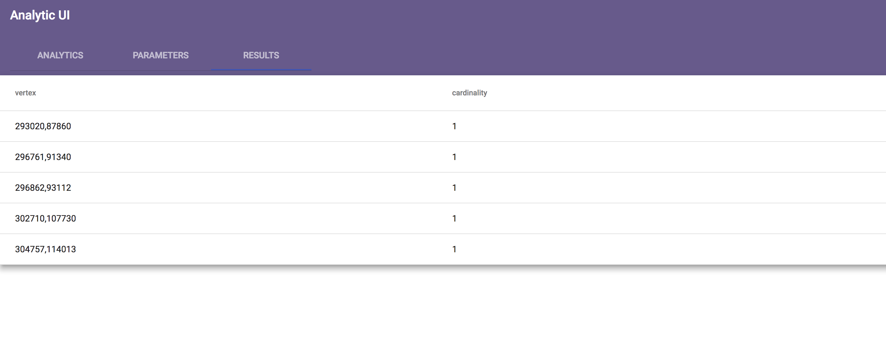
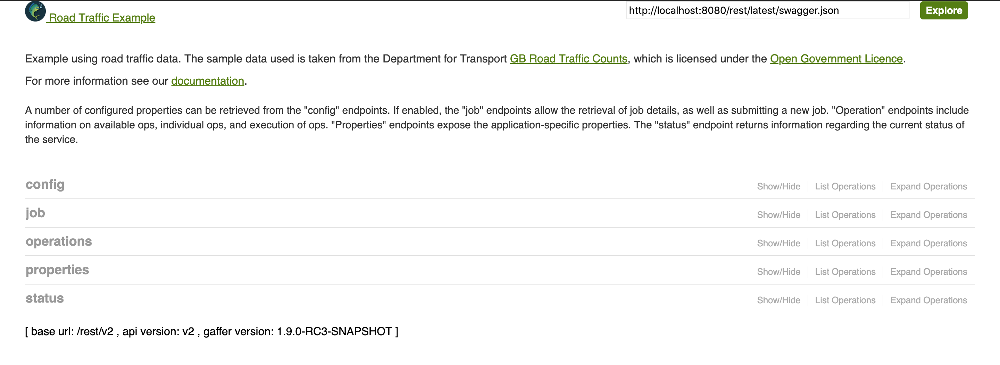

# Overview & Getting Started

A brief explanation of the product, and instructions on how to run the UI and
REST API.

## Overview

The Analytic UI provides the capability for a user to run an ‘Analytic’ query and view the results. The Analytics are pre-defined and may contain parameters that can be changed by the user upon execution of the Analytic. The UI makes a REST API call to an endpoint exposed by the backend. Specific operations exist in the backend for the management of Analytics although the execution of an Analytic is via a NamedOperation. It is written in Typescript/Angular.

## Setting up

Install Homebrew - instructions can be found [here](https://www.howtogeek.com/211541/homebrew-for-os-x-easily-installs-desktop-apps-and-terminal-utilities/)

Having cloned the gaffer-tools repo, in a terminal, navigate to the analytics/analytics-ui folder and run an npm install \(assuming you have npm installed - if you don't, follow [this guide](https://www.npmjs.com/get-npm) or use [Homebrew](https://www.dyclassroom.com/howto-mac/how-to-install-nodejs-and-npm-on-mac-using-homebrew)\):

```
$ npm install
```

Then, install the Angular CLI:

```
$ npm install -g @angular/cli
```

Then, navigate to the top level of the repo and install Maven, which you can do either [this way](http://blog.netgloo.com/2014/08/14/installing-maven-on-mac-os-x-without-homebrew/) or via [Homebrew](https://www.code2bits.com/how-to-install-maven-on-macos-using-homebrew/). Then, run a maven clean install, using -DskipTests to ignore the tests and reduce the time this takes.

```
$ mvn clean install -DskipTests
```

Finally, navigate into analytics/analytics-rest, and run a mvn clean install, with -Pquick:

```
$ mvn clean install -Pquick
```

## Running The REST API

Execute the following in analytics/analytics-rest:

```
$ mvn clean install -pl :analytics-rest -Proad-traffic-demo
```

The REST API should open up in your browser at [http://localhost:8080/rest](http://localhost:8080/rest).

## Running The UI

In a separate terminal window or tab, navigate to the analytic-ui folder and type the following.

```
$ ng serve -o
```

The UI should open up in your default browser at [http://localhost:4200](http://localhost:4200), which will automatically reroute to http://localhost:4200/analytics, our home page. IF you have taken the steps necessary to add your analytics to the restAPI, this page should then have a grid populated with cards corresponding to said analytics.

---

# Using the Analytic UI

A step by step guide to the use of the Analytic UI product

## 1. Analytics

As stated in Getting Started, this whole process requires that one or more analytic\(s\) have been added to your REST API.

To start, select one of the analytics displayed on screen in the grid by clicking the card/tile it is displayed on. Their titles are displayed on the cards, as well as a description appearing below when the card is hovered over.



## 2. Parameters

Once an analytic is selected, the Parameters page will load, displaying the title of the analytic selected, a description of the analytics function, and inputs for each of the individual parameter inputs required for the analytic to run \(e.g. the maximum desired number of results, or a result type to match\). Fill these inputs, and then click the EXECUTE button in the bottom right corner. Depending on the complexity of the analytic, the loading for the next page may take some time. While this happens, a loading spinner will appear next to the EXECUTE button.



## 3. Results

Once the analytic has finished running, the results page will load and display the returned results, either in HTML format or as a data table, depending on which is specified in the analytic. The columns of the table will have titles based on the description of the data provided by the REST API.



---

# Adding an Analytic using the REST API

The following is a step-by-step guide on the use of the REST API to create
analytics to be run in the UI

In this guide we will be constructing a very simple analytic, which gets all cardinality elements and limits the number of results displayed. The end result will be as follows:

## Instructions

1\) Navigate to http://localhost:8080/rest, and you will see the below page



2\) Click on the **operations** section to open it up, and select the **POST/graph/operations/execute** function. This will allow us to put in our operations.


3\) From the **Description** dropdown menu, select _Get All Elements_ and click the **Add Example** button to the right of the dropdown. This will add a simple GetAllElements operation \(as below\) to your Value input.

```
{
   "class": "uk.gov.gchq.gaffer.operation.impl.get.GetAllElements"
}
```

4\) Once again from the Description dropdown, select _Limit_ and click Add Example. This will chain these operations into an **Operation Chain** in the Value input. Change the value assigned to "result-limit" from whatever value has been generated to **"\${result-limit}"** - this will allow the user to input it later. The value input should look like this:

```json
{
   "class": "uk.gov.gchq.gaffer.operation.OperationChain",
   "operations": [
      {
         "class": "uk.gov.gchq.gaffer.operation.impl.get.GetAllElements"
      },
      {
         "class": "uk.gov.gchq.gaffer.operation.impl.Limit",
         "resultLimit": "${result-limit}",
         "truncate": true
      }
   ]
}
```

5\) Add the following view to the GetAllElements operation. This will restrict elements returned to cardinalities and also aggregate them together (So that we get one element per vertex)

```json
"view": {
   "entities": {
      "Cardinality": { 
         "groupBy": []
      }
   }
}
```


6\) Cut the now complete Operation Chain from the value input. then go to the Operation dropdown and select _AddNamedOperation_ and click Add Example. Change the **operationName** and **Description** to whatever you want them to be \(in our example they are "getAllCardinalities" with a description of "Gets all aggregated cardinality elements"\). Then replace the value assigned to **operationChain** with our previously generated operation chain from before by pasting it in.

7\) Finally, we add our parameters in. The following code creates a parameter of "result-limit" which will be assigned to the "\${result-limit}" input we created earlier, with a description, a default value, a value class, and a boolean on whether this is required to run the operation or not. Do this for all the parameters to be inputted in this analytic \(in our case, just the one\)

```json
"parameters": {
   "result-limit": {
      "description": "The maximum number of junctions to return",
      "defaultValue": 2,
      "valueClass": "java.lang.Integer",
      "required": false
   }
}
```

The value input should now be as follows.

```json
{
   "class": "uk.gov.gchq.gaffer.named.operation.AddNamedOperation",
   "operationName": "getAllCardinalities",
   "description": "Gets all aggregated cardinality elements",
   "score": 1,
   "operationChain": { 
      "operations": [
         {
            "class": "GetAllElements",
            "view": {
               "entities": {
                  "Cardinality": { 
                     "groupBy": []
                  }
               }
            }
         },
         {
            "class": "uk.gov.gchq.gaffer.operation.impl.Limit",
            "resultLimit": "${result-limit}",
            "truncate": true
         }
      ]
   },
   "parameters": {
         "result-limit": {
         "description": "The maximum number of junctions to return",
         "defaultValue": 2,
         "valueClass": "java.lang.Integer",
         "required": false
         }
      },
   "overwriteFlag": true
}
```

8\) Click the **Try it out!** button in the bottom left hand corner, and check down to see the response. If the REST API has given a 200 code response, then that means the Named Operation has been successfully added to your REST API, and can be used in Analytics, one of which we will add in the next few steps.

9\) Again from the Description dropdown, select _AddAnalytic_ and click Add Example - a blank analytic will be generated. Make sure to give the analytic a name to be displayed by altering the value given to **analyticName** \(in our example, Get All Cardialities\) and to make sure **operationName** matches the name of the named operation we have generated \(in our example, getAllCardinalities\).

Add a **Description**, and alter the **metaData** - change the input of **iconURL** to the name of an icon from the Material Design icon library \(a full list of which can be found [here](https://material.io/tools/icons/)\), and add a **"color"** input and specify a color for the analytic card \(in this example, we chose "yellow"\). Your code should match the excerpt below.

For this example, we also use an output adapter to take elements and convert them into something which will display in the table correctly. The table component takes simple objects (booleans / strings / integers) and objects of simple key value format.

```json
{
   "class": "uk.gov.gchq.gaffer.analytic.operation.AddAnalytic",
   "analyticName": "Get All Cardinalities",
   "operationName": "getAllCardinalities",
   "description": "Gets a list of vertices and their cardinalities within the graph",
   "score": 4,
   "metaData": {
      "iconURL": "public",
      "color" : "yellow"
   },
   "uiMapping": {
      "param1": {
         "label": "Maximum Results",
         "userInputType": "TextBox",
         "parameterName": "result-limit"
      }
   },
   "outputVisualisation": {
      "visualisationType": "TABLE",
      "outputAdapter": {
         "class": "IterableFunction",
         "functions": [
            {
               "class": "uk.gov.gchq.gaffer.analytic.function.ToMap",
               "keyFunctions": {
                  "vertex": {
                     "class": "ExtractId",
                     "id": "VERTEX"
                  },
                  "cardinality": {
                     "class": "FunctionComposite",
                     "functions": [
                        {
                           "class": "ExtractProperty",
                           "name": "hllp"
                        },
                        {
                           "class": "CallMethod",
                           "method": "cardinality"
                        }
                     ]
                  }
               }
            }
         ]
      }
  },
  "overwriteFlag": true
}
```

10\) Click the **Try it out!** button in the bottom left hand corner, and check down to see the response. If the REST API has given a 200 code response, then that means the Analytic has been successfully added to your REST API, and when the UI is opened, it will be displayed in the grid.
